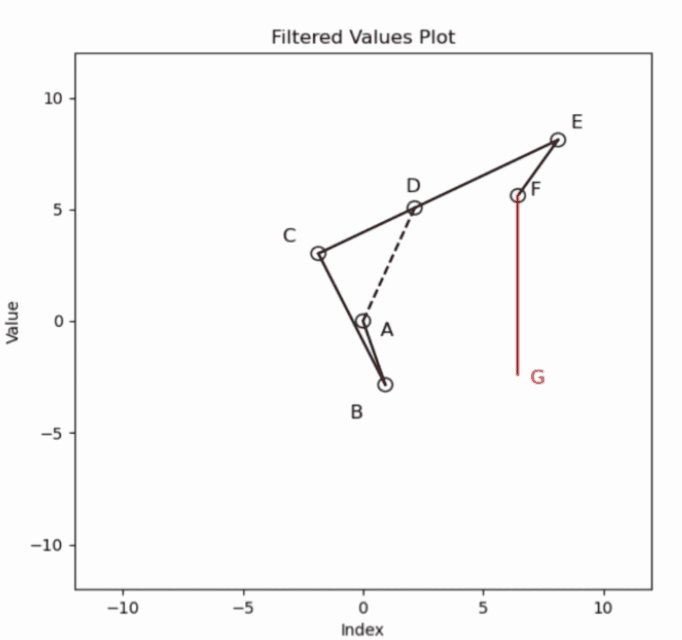
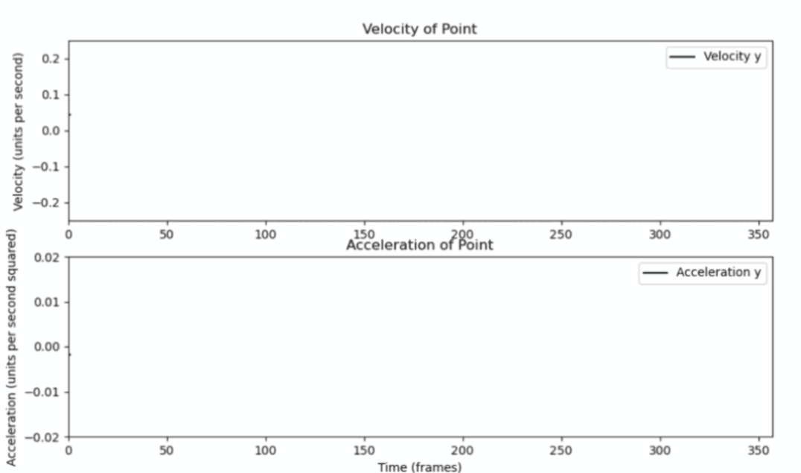

# 目录
* [1.功能介绍](#1.功能介绍)
* [2.效果展示](#2.效果展示)
* [3.主要函数介绍](#3.主要函数介绍)
* [4.实现方案](#4实现方案)
* [5.目前存在问题]()

# 1.功能介绍
|    模块     |     功能     |
| :---:       |    :----:   |
|  运动方程的建立与求解 |  通过解析法建立插齿机运动方程 再带入原动件运动规律对机构位置进行求解  |
|  运动仿真  | 设置插齿机各结构参数后进行整体机构运动学仿真 |
|  力矩分析  | 对插齿机运动过程中产生的力矩进行计算 |

# 2.效果展示
* 运动方程的建立
运动方程的建立在原理课本中有详细的介绍，本机构的建立过程在 [`files/19_插齿机主运动机构计算机课程设计说明书-2024.pdf(点击即可跳转)`](files/19_插齿机主运动机构计算机课程设计说明书-2024.pdf) 中有详细介绍，在此不作赘述。
 

* 运动方程的求解
由于建立的运动方程为非线性方程，在原方程经过欧拉转换、实部虚部分离进行线性化后，为了降低编程前公式推导的工作量，我采用了 Numpy 库进行暴力求解。后续的数值计算除了 Numpy 使用了 Sypy 库。机构每个点的具体计算结果请看 annex 文件夹中的 Excel 表格。
 

* 运动仿真
得到运动方程的解后我采用了 Matplotlib 库实现机构运动的可视化。
 
 

* 执行机构运动曲线
我单独制作了执行机构的运动曲线，包括速度和加速度，以便能好的反应其运动特性。
 
 

* 力矩分析（不考虑摩擦）
力矩分析按照  [`files/指导书--考虑摩擦和惯性力的机构受力分析方法（注）20210929.pdf(点击即可跳转)`](files/指导书--考虑摩擦和惯性力的机构受力分析方法（注）20210929.pdf) 中介绍的方法进行计算。计算结果并未校准，数值可能不正确，尚未合并到主程序中。
 

# 3.主要函数介绍
|    函数声明     |     功能     |
| :---:       |    :----:   |
| calculate_phi(l1, l2, l3, s1, phi1_deg, theta1_deg)  |  构建插齿机左侧机构的运动方程并求解 phi3 大小  |
|  calculate_phi4_and_s2(l3r, l4, phi3_degrees, e)  | 通过几何关系求出执行机构的运动 |
|  compute_kinematics(data_matrix, set_speed)  | 使用差商法计算各关键点的角速度与角加速度 |
|  process_range(l1, l2, l3, s1, theta1_deg, start_deg, end_deg, output_list, progress_counter)  |  多线程暴力求解方程  |
|  InfoMat_calculation(data_matrix, l1, l3_left, l3_right, l4, l5, s1, theta1_deg)  |  计算机械连杆系统中各点的位置，并将每个原动件位置坐标，并存入一个大小为 1 * 2 * 7 的三维矩阵中。  |
|  plot_velocity_acceleration(InfoMat, dt=1.0, point_index=6)  |  计算执行机构的速度与加速度  |
|  frictionless_moment(InfoMat, data_matrix, m, l, dt)  |  使用差商法计算出除了执行机构其余各点的速度与加速度  |
|  run_frictionless_moment(InfoMat, data_matrix, m, l, dt=1)  |  绘图线程启动函数  |
|  set_speeds(degree_value)  |  设置仿真机构的运动输入  |
|  simulation(l1, l2, l3_left, l3_right, l4, l5, e, s1, theta1_deg, radian_value)  |  仿真部分主函数，包含仿真的一系列初始化  |

# 4.实现方案
详情请见 [`files/19_插齿机主运动机构计算机课程设计说明书-2024.pdf(点击即可跳转)`](files/19_插齿机主运动机构计算机课程设计说明书-2024.pdf)。

# 5.目前存在问题
* 运动方程求解的正常做法应该是在原方程经过欧拉转换、实部虚部分离进行线性化后求出逆矩阵进行求解。但我为了节省公式推导的工作量采用 Numpy 库暴力求解，使用了处理器较多计算资源，并且计算速度较为缓慢，没有达到我的预期。
* 由于时间原因我仅对不考虑摩擦情况下的力矩进行了计算，并且结果尚未校准。
* 设置杆长界面 UI 在计算时会弹出多个窗口，需要手动关闭才能正常运行。
* 尚未加入机构杆长条件判断。

